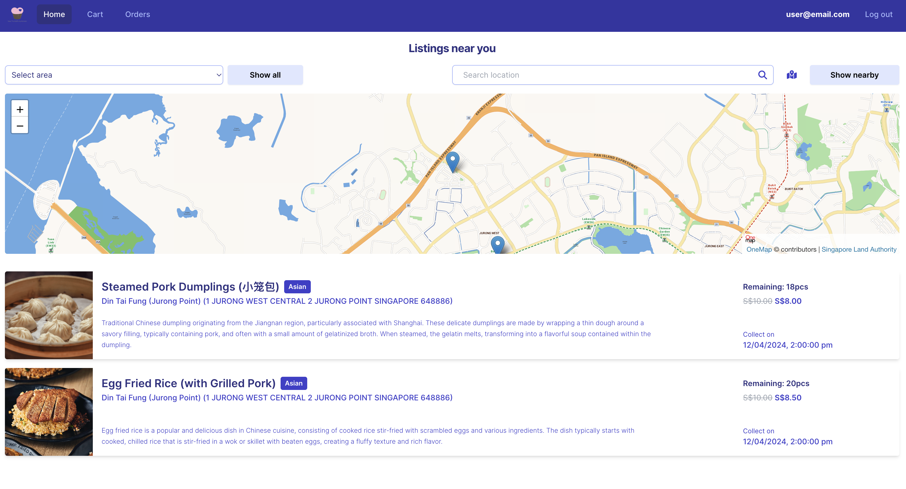
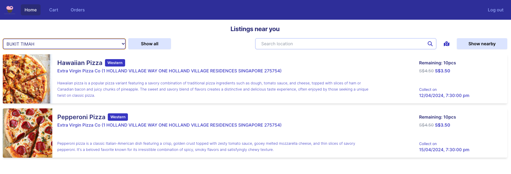
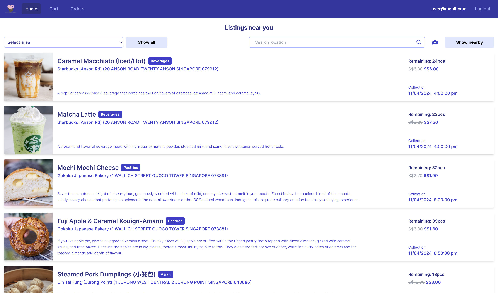
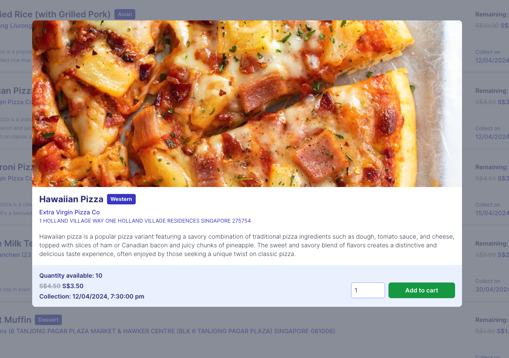
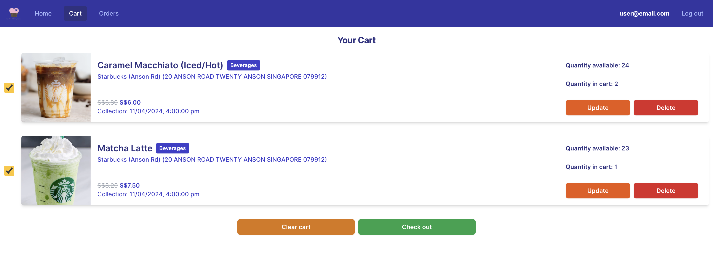
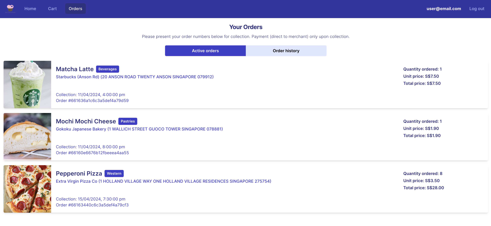
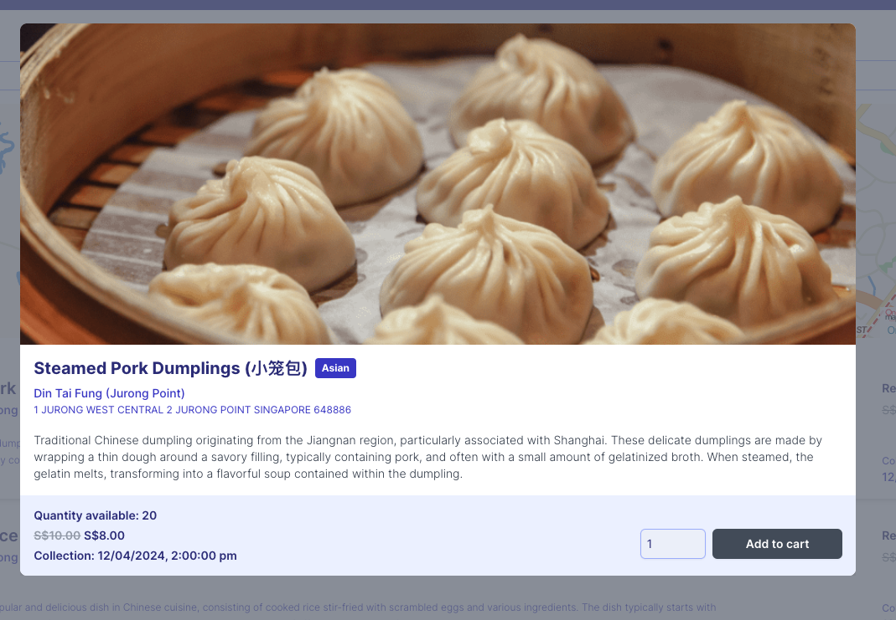
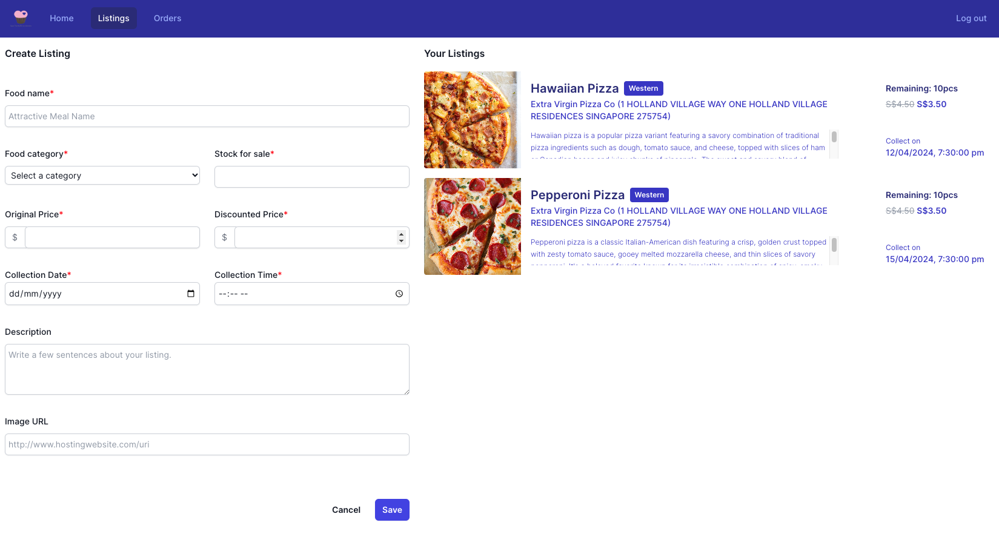
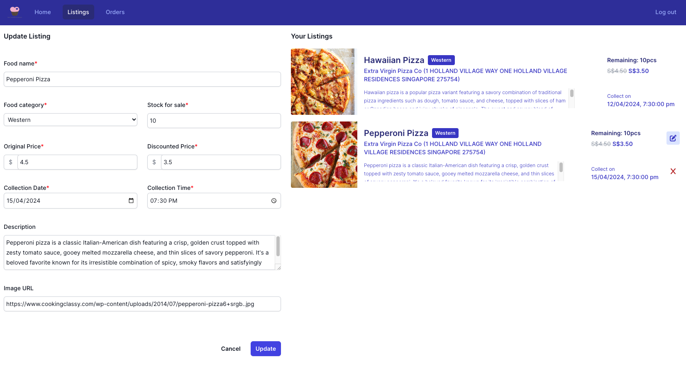
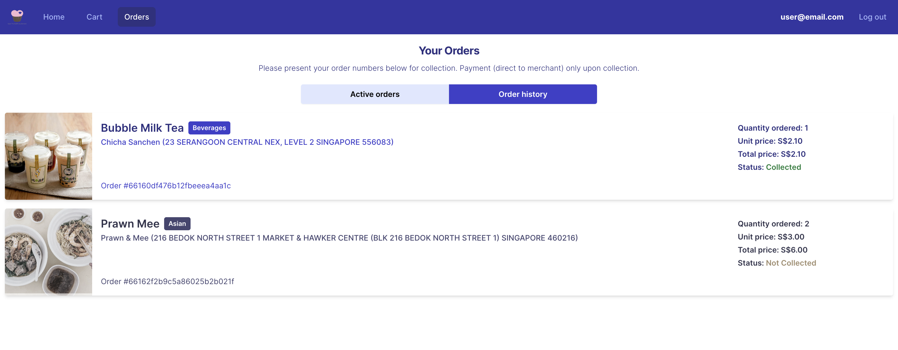

# GA SEI Project 3 - Save The Muffin

## Introduction

Save The Muffin is an app that lets you rescue unsold food from the waste bin at your favourite F&B outlets. Use Save The Muffin to explore F&B outlets in your vicinity and purchase unsold food at non-peak period at discounted prices.

You can do your bid to reduce food waste. Save The Muffin.

## Technology

**Front-end:**

- HTML
- CSS (Tailwind CSS)
- JavaScript
- React

**Back-end:**

- Express
- MongoDB (Mongoose)

## Getting Started

Please enable location services before using our app for optimum experience.

- Deployed app: TBC
- Public board: https://trello.com/b/QsnzXCx7/ga-sei-project-3

### User Journey (User)

1. Upon log in, a user will be directed to the "Home" page, which will, by default, display listings nearby the user (i.e., within a 3km radius). The user's location is obtained via geolocation services provided by the OneMap API (https://www.onemap.gov.sg/apidocs/).



2. The user will be able to search for listings nearby a specified location using the search bar. A map will be displayed showing the user's current location relative to nearby listings in the vicinity. The user can either click on the locator on the map _or_ the listing itself to view further information regarding the listing in a pop-up modal.






3. Alternatively, the user can filter for listings based on areas of Singapore in a dropdown menu _or_ simply see all listings available presently. The map will not show if the user searches for listings via this method.

4. When the listing modal pops up, the user can add the listing to cart, limited by the quantity made available by the merchant.



5. On the "Cart" page, the user will be able to see and manage (i.e., delete or change quantity) all the food listings added to their cart. By default, all listings will be checked for check out but the user can deselect listings to be checked out at a later time. When the "Check out" button is clicked, all selected listings will be confirmed and shown on the merchant-side of the app.



6. The user can view all their orders on the "Orders" page, which contains 2 tabs - an "Active Orders" tab and an "Order History" tab. The "Active Orders" tab displays all orders that have yet to be fulfilled (i.e., not collected by the user), while the "Order History" tab displays all orders that have been fulfilled and completed. For the current version of the app, in-app payment is not supported yet; all payments have to be made directly to merchants upon collection.



### User Journey (Merchant)

1. Upon log in, the merchant will also have access to the "Home" page which the user sees. However, certain features will not be available to the merchant (e.g., add to cart)



2. The merchant can create new or manage existing listings on the "Listings" page.





3. On the "Orders" page, the merchant can view all orders placed for its listings that are pending collection by users on the "Active Orders" tab. This functions as a dashboard that allows the merchant to manage collection by users. When a user successfully collects and pays for their orders, the merchant can click on the "Order Collected" button to indicate that an order has been completed. The order will then be moved to the "Order History" tab.


4. On the user-side of the app, when the merchant indicates that an order has been collected, the order will move from the user's "Active Orders" tab to the "Order History" tab. If an order is not collected by the specified collection date, this will be reflected in the user's "Order History" tab, as status "Uncollected".



## Ice Box

- Develop a mobile-friendly version of the app
- Create a feature that allows users to review listings and view other users' reviews
- Create a feature that allows users to filter listings other than by location (e.g., food category, price, collection date/time, ratings, etc.)
- Implement a notification feature when collection date/time is impending
- Integrate in-app payment methods into the app
- Allow a system administrator to review and approve merchant listings before they are made publicly available to users, to ensure quality control

## References

- Calculating distances between two points on the earth: https://stackoverflow.com/questions/639695/how-to-convert-latitude-or-longitude-to-meters
- Too Good To Go App (not available in Singapore): https://www.toogoodtogo.com/en-gb

### .env structure (front-end)

```
VITE_SERVER=http://localhost:5001
VITE_ONE_MAP=https://www.onemap.gov.sg/
VITE_ONE_MAP_EMAIL=<youremail@email.com>
VITE_ONE_MAP_PASSWORD=<yourpasswordhere>
```

### .env structure (back-end)

```
PORT=5001
MONGODB_URI=mongodb+srv://<username>:<password>@project3.94fwvtt.mongodb.net/Project3
ACCESS_SECRET=<access_secret>
REFRESH_SECRET=<refresh_secret>
```
